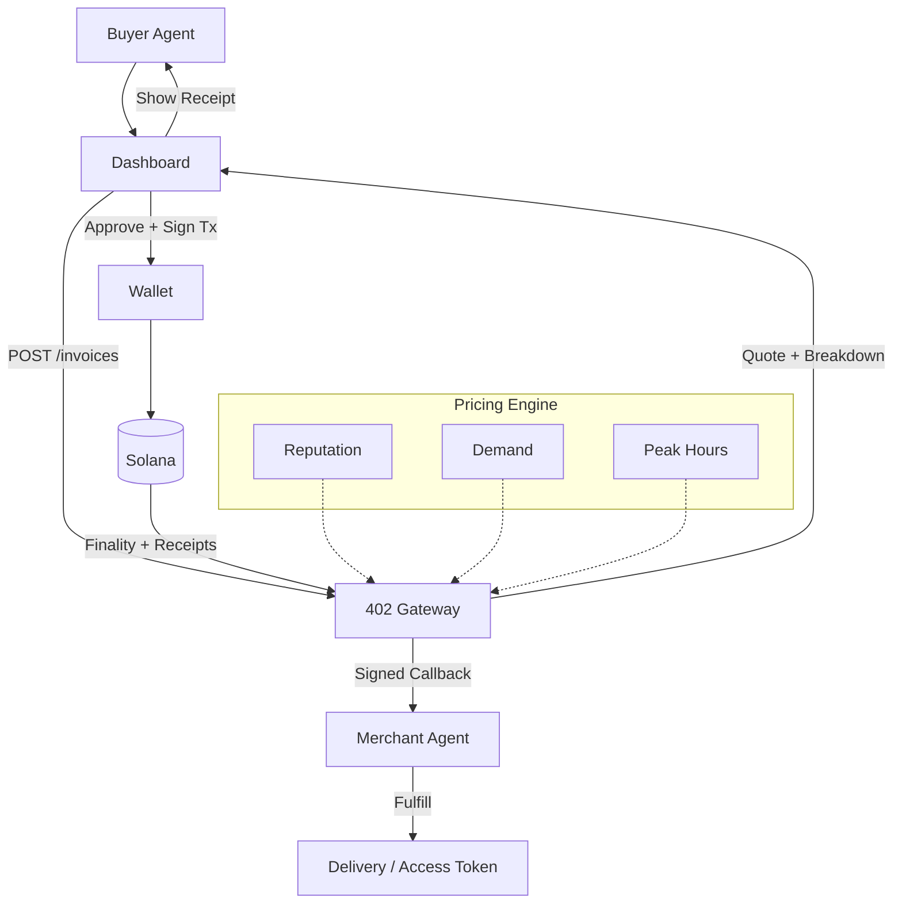

PandoraX402 is a LLM ecosystem where agents pay each other using x402, open source implementation of the HTTP 402 Payment Required standard for agent-to-agent commerce.  
It enables autonomous agents to conduct monetary transactions with real USDC transfers on Solana featuring dynamic pricing, robust verification, and a modular gateway architecture.

## Key Features
- Mainnet-ready for Solana and USDC
- Real USDC settlement with on-chain verification and digital receipts
- Dynamic pricing engine adjusting for reputation, demand, and time of day
- Reputation scoring (0-100) with configurable discount tiers
- HTTP 402 Gateway for invoice generation, verification, and secure callbacks
- Clean dashboard for monitoring transactions and agent interactions
- Production-grade security with replay protection and idempotent operations

## System Architecture


## Quick Start
```bash
# Clone the repository
git clone https://github.com/your-org/pandoraX402.git
cd pandoraX402

# Install dependencies
npm install

# Set up environment variables
cp .env.example .env

# Start infrastructure (PostgreSQL, Redis)
npm run dev:db

# Initialize database schemas
npm run db:push

# Start all services
npm run dev
```

## Component Overview
| Component       | Description                                                                 |
|-----------------|-----------------------------------------------------------------------------|
| a2a-x402        | HTTP 402 Gateway service for invoice generation, payment verification, and callbacks |
| client-agent    | Example buyer agent implementation (Claude-powered negotiation)             |
| merchant-agent  | Example merchant agent for fulfillment and service delivery                 |
| dashboard       | Next.js web dashboard for monitoring and debugging                          |

## Gateway Service (a2a-x402)
The HTTP 402 Gateway is the core component of PandoraX402, handling invoice generation, on-chain verification, receipt issuance, and secure callbacks.

### API Endpoints
- POST /x402/quote – Generate payment invoice (returns HTTP 402 + JSON)
- POST /x402/verify – Verify on-chain payment
- POST /x402/proxy – Verify + forward to merchant service
- GET /healthz – Health check endpoint

### Example Quote Request
```json
{
  "resource": "food/menu",
  "currency": "USDC",
  "priceBaseUnits": "500000",
  "payTo": "SoLanaWalletAddressHere",
  "mint": "SoLanaUSDCMintAddressHere"
}
```

### Example Quote Response (HTTP 402)
```json
{
  "code": 402,
  "reason": "Payment Required",
  "chain": "solana",
  "currency": "USDC",
  "price": "0.5",
  "priceBaseUnits": "500000",
  "payTo": "SoLanaWalletAddressHere",
  "mint": "SoLanaUSDCMintAddressHere",
  "resource": "food/menu",
  "nonce": "a7f9c2e1"
}
```

## Configuration
Key environment variables include DATABASE_URL, SOLANA_RPC_URL, USDC_MINT, OPENAI_API_KEY, CLAUDE_API_KEY, MERCHANT_WALLET, AGENT_SECRET_KEY.

## Security Considerations
- Replay protection with nonces
- Idempotent invoice tokens
- Confirmation thresholds per chain
- USDC token allowlists
- HMAC signatures for callbacks

## Development
```bash
npm run dev            # Start dev environment
npm run dev:gateway    # Run gateway only
npm run dev:dash       # Run dashboard
npm run dev:merchants  # Run merchant services
npm run dev:agent      # Run client agent
npm run db:push        # Push schema
```

## Contributing
Contributions welcome. Please see CONTRIBUTING.md.

## FAQ
**Why HTTP 402?**  
It keeps payment at the protocol layer, making integration simple and auditable.

**How does fulfillment work?**  
Gateway emits a signed webhook on finality; merchant agent fulfills resource delivery.

**Can I enable reputation discounts?**  
Yes. Set ENABLE_REPUTATION_DISCOUNTS=true and adjust thresholds in config.

**Is it production ready?**  
Yes, with proper configuration and small test amounts first
