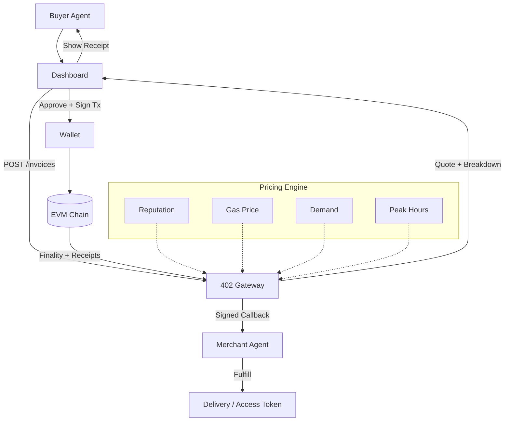

 PandoraX402 — HTTP 402 Agent-to-Agent Payments

Base • Polygon • Ethereum • USDC settlement • Optional Claude LLM policy

PandoraX402 is a production-ready, open source implementation of the HTTP 402 Payment Required
standard. It enables agent-to-agent commerce with real USDC transfers on EVM chains, a dynamic
pricing engine, and a modular gateway architecture.

image

TL;DR (LIVE)
```
npm install
cp .env.example .env
# Fill in RPC URLs, USDC token addresses, and API keys

# Run gateway
npm run dev --workspace a2a-x402

# Run client agent (Claude-driven buyer)
npm run dev --workspace client-agent

# Run merchant agent (fulfillment)
npm run dev --workspace merchant-agent

# Start dashboard
npm run dev --workspace dashboard
```
Highlights
- Mainnet-ready for Base (8453), Polygon (137), Ethereum (1)
- Real USDC settlement with receipts and on-chain proofs
- Dynamic pricing (reputation, demand, gas congestion, peak-hour adjustment)
- Reputation scoring (0-100) with optional discounts
- Clean dashboard: wallet connect, invoice view, fulfillment status
- HTTP 402 Gateway: invoices, signed callbacks, replay protection
- Open source TypeScript/Node monorepo, MIT license

Supported Components
Component           Description
a2a-x402            HTTP 402 gateway (invoices, receipts, pricing, webhooks)
client-agent        Example buyer agent using Claude API
merchant-agent      Example merchant agent for fulfillment
dashboard           Web dashboard (Next.js) for operators and test purchases

Architecture (High-Level)


Configuration
Key variables (see .env.example):
- CLAUDE_API_KEY (required for LLM buyer agent)
- ETH_RPC_URL, BASE_RPC_URL, POLYGON_RPC_URL
- USDC addresses per chain
- Limits: confirmations, caps, daily frequency

Risk Controls (Defaults)
- Confirmation gates (Ethereum: 3+, Polygon: 2+, Base: 1+)
- Idempotent invoice tokens
- Replay protection (HMAC nonce + timestamp)
- Strict USDC allowlist

Development Checklist
- Fill .env with RPCs and keys
- Verify USDC token addresses
- Start with small test amounts
- Enable LLM policy only if needed

FAQ
Q: Why HTTP 402?
A: Payment remains at the protocol layer, keeping integration simple and auditable.

Q: Can I enable leaderboards?
A: Reputation scoring is included but public leaderboards are disabled by default.

Q: How does fulfillment work?
A: Gateway emits signed webhook to merchant agent once finality is reached; merchant agent fulfills accordingly.

Legal
MIT licensed. No warranties. Operators are responsible for their own keys, compliance, and risk management.
